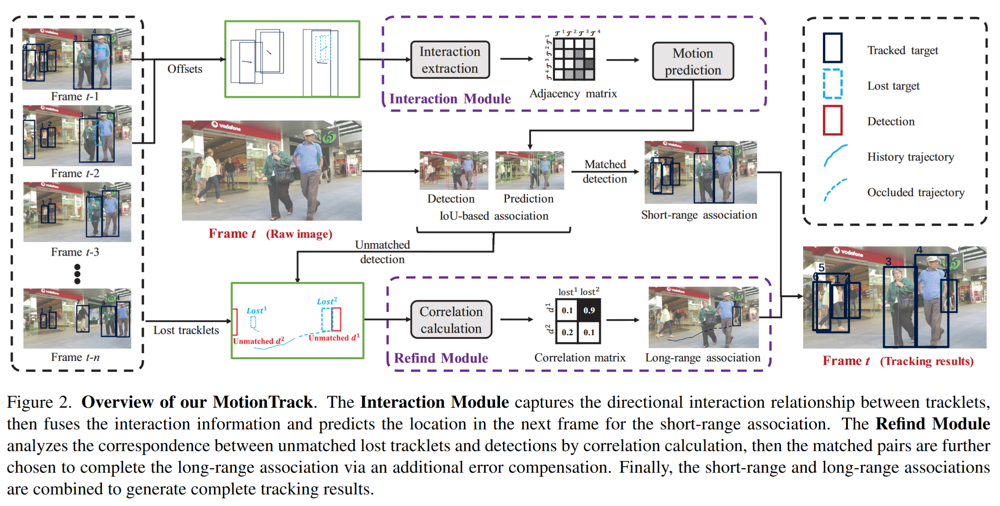

# MotionTrack: Learning Robust Short-term and Long-term Motions for Multi-Object Tracking
paper: https://arxiv.org/pdf/2303.10404
## Abstract
- 提出了一个简单高效的 MOT 框架：MotionTrack
  - 用一个统一的框架学习短期和长期的运动，从而关联短期和长期的track
  - 对于密集人群：设计了一个Interaction Module，从短期轨迹中学习交互感知运动，它可以估计每个目标的复杂运动
  - 对于极度遮挡：设计了一个Refind Module，从目标的历史轨迹中学习可靠的长期运动，该模块可以将中断的轨迹与其相应的检测联系起来
- Interaction Module和Refind Module被嵌入到了tracking-by-detection范式中，它们可以协同工作以保持卓越的性能
- MOT17、MOT20数据集上达到了SOTA
- 应对场景：密集人群、极度遮挡

## Introduction
现存的MOT方法的两种范式：
- tracking-by-detection：首先检测每个视频帧中的对象，然后关联相邻帧之间的检测以随着时间的推移创建单独的目标轨迹
- tracking-by-regression：目标检测器不仅提供逐帧检测，还用每个轨迹到其新位置的连续回归来替换数据关联

面临的问题：短期和长期
- 短期：如何在短时间内将活动的轨迹与检测关联起来
  - 过去的方法：相邻帧使用可区分性的运动模式或外观特征来引导数据关联
  - 存在的问题：
    - 密集人群：行人的运动不是独立的，会受到周围邻居的影响以避免碰撞，故难以学习运动模式
    - 极度遮挡：行人很容易被固定物体长期遮挡，被遮挡的行人的检测框的尺寸会小到难以取得准确的外观特征
- 长期：如何在长时间后重新识别丢失的轨迹与检测
  - 过去的方法：
    - 学习可区分性的外观特征对被遮挡而丢失的track做重识别
    - memory技术：为每个目标存储特征以multi-query的方式匹配不同目标
  - 存在的问题：
    - 不同姿势、低分辨率、低照明：影响外观特征
    - memory模块和Multi-query机制的存储和时间开销很大：不利于实时tracking

贡献：
- 提出了一个简单高效的 MOT 框架：MotionTrack。遵循tracking-by-detection范式
- 为解决短期关联：设计了一个Interaction Module，用于模拟目标之间的所有交互
  - 可以预测行人的复杂运动以避免碰撞
  - 使用非对称邻接矩阵来表示目标之间的交互
  - 通过图卷积网络进行信息融合后得到预测
- 为解决长期关联：设计了一个Refind Module，用于重新识别丢失的目标
  - 相关性计算：将历史轨迹和当前检测的特征作为输入，并计算相关矩阵来表示它们关联的可能性
  - 误差补偿：修正被遮挡的轨迹
- MOT17、MOT20数据集上达到了 SOTA

## Related Work
### Motion Models
运动模型可以分为：
- filter-based方法：将运动预测视为状态估计
  - KF：卡尔曼滤波。线性恒速模型，基于目标和相机运动是独立的假设，如SORT
  - camera motion compensation：相机运动补偿，如：BoT-SORT、StrongSORT
  - KF的变体：如：StrongSORT、GIAOTracker (mcmot)
- model-based方法：以基于数据驱动的范式，结合运动和视觉信息提供运动预测
  - Tracktor：采用Faster R-CNN的回归部分来预测相邻帧之间目标的位移
  - FFT：添加光流以帮助回归位移
  - CenterTrack：构建了一个tracking分支来专门预测运动
  - ArTIST：将运动视为一种概率分布，并通过最大池化对一个特征隐式建模所有周围的交互
  - 问题：大多数运动模型不考虑目标之间的显式交互，尤其是在密集的人群场景中。他们无法准确估计附近目标的复杂运动

### Occlusion
遮挡分为短期遮挡和长期遮挡：
- 短期遮挡
  - [TADAM](https://arxiv.org/pdf/2104.00380)：将未遮挡和遮挡目标分开
- 长期遮挡
  - DeepSORT：先将检测框匹配到存活的track上，然后基于外观特征匹配到丢失的track上
  - MeMOT：将track的外观特征存储到memory中，用检索
  - QuoVadis：将轨迹转换为鸟瞰图
  - ByteTrack：利用迭代预测的track (丢失的) 和检测之间的IoU分数做重识别
  - 问题：随着遮挡时间变长，这些方法将变得不太可靠

# Method

## Overview of MotionTrack
MotionTrack分为两步：
- Step1：短期关联。对track间交互进行建模以获得更准确的预测和短程跟踪结果
- Step2：长期关联。根据历史track和不匹配的检测重新识别丢失的track，然后在遮挡期间补偿track

## Interaction Module
构建track之间的定向交互以获得帧 $t$ 的预测。分为两个阶段：
- Interaction Extraction (交互提取)。连接绝对坐标矩阵和坐标偏移量矩阵。如图3所示，输入这个连接矩阵，经过一些操作，输出一个非对称交互矩阵，每个元素表示一个track对另一个track的影响。具体的操作有：
  - 连接矩阵先输入到自注意力模块
  - 为进一步考虑整个场景，如群体行为，将自注意力的结果，级联输入到非对称卷积模块
  - 为了捕获track之间的重要交互，只保留高注意力值
  - 归一化交互矩阵的所有非零元素
- Motion Prediction (运动预测)。输入交互矩阵。具体的操作有：
  - 使用图卷积来融合每个track的交互
  - 使用MLP获得偏移量预测
- 与ByteTrack一样的关联策略：用匹配上的检测去更新存活的track，记录丢失的track的Interaction Module的预测

## Refind Module
重新找到丢失的轨迹。分为两个阶段：
- Correlation Calculation (相关性计算)。在IoU关联后，得到了未匹配检测矩阵 $D^{rest}\in R^{U\times 5}$ 和丢失track矩阵 $T^{lost}\in R^{S\times30\times5}$ ，30是指保留每个丢失track的最后30个存活的状态的位置，最后一维包括了时间和位置，即 $(t,x,y,w,h)$ 。如图4所示，输入这两个矩阵，具体的操作有：
  - 对 $D^{rest}$ 和 $T^{lost}$ 在最后一个维度上做归一化，然后分别提取特征：
    1. 对 $T^{lost}$ 的第二和第三维度上做非对称卷积，然后池化为特征向量 $F^{traj}\in R^{S\times D}$ 
    2. 计算检测与丢失track的最后1个存活状态的位置之间的difference，并且和检测连接起来 $D^{\hat{rest}}\in R^{(S\times U)\times 10}$ ，然后将连接矩阵映射到高维特征 $F^{dete}\in R^{(S\times U)\times D}$ 
   - 连接 $F^{traj}$ 和 $F^{dete}$ 为特征矩阵 $F\in R^{(S\times U)\times 2D}$ ，该矩阵建模了track的空间分布模式和速度-时间关系等信息
   - 送入Fc+Sigmoid，得到correlation matrix
   - 使用贪婪算法来选择具有高相关性得分的匹配对，并将剩余的不匹配检测初始化为新的track
 - Error Compensation (误差补偿)。与其他插值方法不同，这里纠正预测的轨迹而不是生成新的轨迹
   - 使用匹配到的检测 $d^t$ 和丢失track的预测 $p^t$ 来推理出遮挡期间的误差，并完善track的预测。

其中track在 $t_1$ 丢失，在 $t_2$ 被重新发现

## Experiments
### MOT17 test set

### MOT20 test set

### Interaction Module和Refind Module的消融实验

### Interaction Module预测目标运动的能力

比较预测精度，取所有目标的平均IoU来计算总IoU得分。结果表明，交互模块的引入比传统卡尔曼滤波器产生更准确的预测。同时，IDF1和AssA的稳步改进表明交互模块提高了预测精度并带来更强的关联能力
### Refind Module处理长期遮挡的能力

提高遮挡时间，比较模型处理长期遮挡的能力。前两种方法（DeepSORT和ByteTrack）由于大量错误关联而导致性能急剧下降，而本方法在处理长期遮挡方面取得了一致的改进
### 人群遮挡的额外评估

极端遮挡和密集人群并不总是出现在跟踪场景中。因此，评估整个数据集并不能反映我们直接解决这两个挑战性问题的能力。为了解决这个问题，本文建议将MOTA修改为crowdMOTA，它将数据集中可能被遮挡或拥挤的人分开，并评估这些人的跟踪性能。特别是，我们通过数据集中的可见性标签来选择人员，即当可见性低于 0.25 时，考虑人员拥挤或被遮挡。本文将连续遮挡或拥挤的最小帧数设置为 20 到 100，以验证不同难度级别样本的解决方案。如表5所示，不同难度样本的改进说明了本文的方法在解决密集人群和极端遮挡方面的有效性