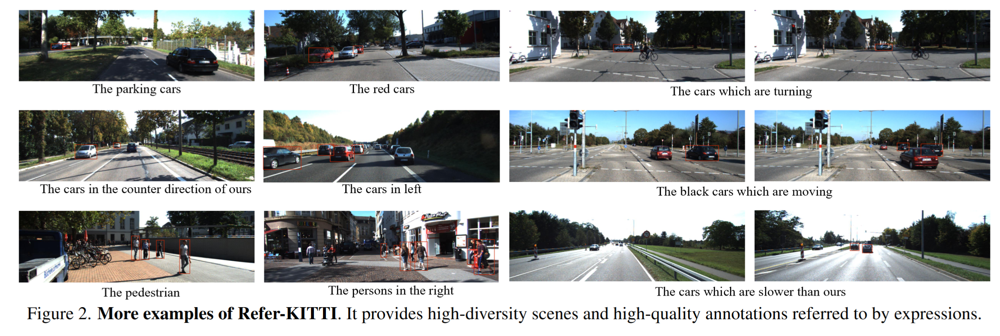
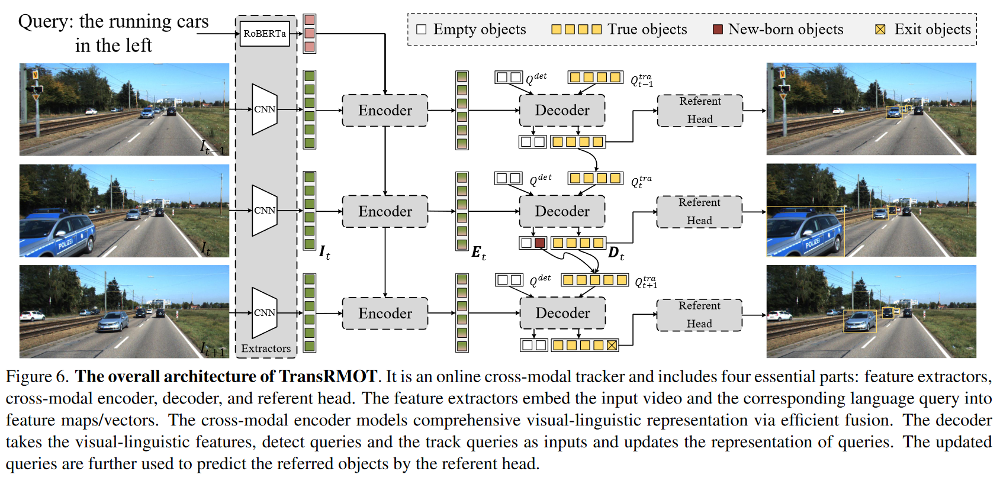

# Referring Multi-Object Tracking
https://arxiv.org/pdf/2303.03366

# Abstract
- 指代多目标跟踪 (Referring multi-object tracking, RMOT) 任务：第一个在视频中实现任意数量的指代目标预测的工作
- Refer-KiTTI 数据集
- TransRMOT 框架

# Introduction
提出由语言描述引导的新视频理解任务：
- 给定语言表达作为参考，它的目标是为定位视频中所有语义匹配的目标
- 一个表达式包括多个目标。如图1(a)所示，这个query对应第20帧的1个目标、第40帧的2个目标
- 考虑时间状态的变化。如图1(b)所示，只有当汽车开始转弯动作时才能被检测到，如果汽车完成转弯动作，跟踪就会结束

提出RMOT的新数据集Refer-KITTI，特点有：
- 指代目标的数量有高灵活性。1个表达式对应的目标数为0~105，平均10.7
- 高时间动态性。目标涵盖的时间为0~400帧
- 标注成本低。提供了一个高效的标注工具

提出TransRMOT：跨模态学习

# Related Work
- 指代理解方法 (除MOT以外方向)
  - 核心挑战：对跨模态源 (视觉和语言) 的语义对齐进行建模
  - 早期的方法
    - 采用两个独立的阶段：
      - 目标检测阶段：获得检测结果
      - 目标匹配阶段：学习检测结果和语言表达式之间的相似性来找到最匹配的检测作为最终目标
    - 问题：依赖于目标检测的质量
  - 后来的方法
    - 设计单阶段的pipeline
    - 将视觉和语言模态融合在早期特征上，而不是检测结果上
    - 融合策略主要采用跨模态注意力机制

- Refer-KITTI数据集
  - 低人力开销的数据标注：在KITTI的标注基础上，只需要点击动作的开始帧和结束帧，就会自动标注中间帧的标签
  - 15个训练视频、3个测试视频
  - 和其他指代理解数据集的对比如表1所示

- 评估指标
  - HOTA：整体 HOTA 是通过对不同句子query进行平均来计算的

# Method
## Network Architesture
模型如图6所示，类似于MOTR，主要基于Deformable DETR，为适应跨模态输入做了些修改。包括4个结构：
- feature extractors：
  - 作用：提取视频和文本的视觉和语言特征
  - 做法：
    - CNN backbone模型逐帧提取金字塔视觉特征图，形状为 $C_l\times H_l \times W_l$ ，分别表示第l层特征图的通道、高度、宽度
    - 预训练语言模型将L个单词嵌入到2D的特征中，形状为L*D，D为单词的特征维度
- cross-modal encoder：
  - 作用：融合视觉、语言模态的特征
  - 常规做法：连接2种特征并将他们送入encoder，通过自注意力来建模密集的联系。问题是由于图片的大量token数量，自注意力的计算量是庞大的
  - 本文做法，如图7所示：
    - 对视觉特征图，用1*1卷积 (相当于全连接网络)，将特征图的通道数降维到d=256，再将特征图展开为2D张量，形状为 $H_lW_l\times d$
    - 对语言特征，为保持和视觉特征相同的通道数，用全连接层将语言特征投影到 $L \times d$
    - 通过3个全连接层，将视觉和语言特征转换为Q, K和V：
        

        其中， $P^V$ 和 $P^L$ 为视觉和语言的位置编码
    - 原始的视觉特征和以视觉为先验条件的语言特征相加来产生融合特征：
        

    - 通过一堆deformable encoder层来促进跨模态交互：
        

- decoder：
  - 作用：更新目标query
  - 做法：
    - 类似MOTR，2个query：
      - track query：利用上一帧的decode输出的embedding来更新当前帧的tracking query，以跟踪相同目标
      - detect query：detect query表示当前帧新出现的目标
    - 利用queries去tracking的过程见图6
      - $D_{t-1}$ 为t-1帧时decoder输出的embedding，去掉对应于空目标或消失目标的embedding，用自注意力和前馈网络转换成第t帧的track query $Q_t^{tra}$ ，用 $Q^{det}$ 表示detect query，将这2种query连接输入到decoder学习目标表示 $D_t$ ：
        

        输出embedding的第1维长度为track query的第1维长度和detect query的第1维长度之和
- referent head：
  - 作用：基于预测的分类、边界框和指代分数来预测目标序列
  - 做法：
    - 包括class、box和referring分支
      - class：线性映射，它输出一个二进制的概率，指示输出embedding代表真对象还是空对象
      - box：3层除了最后1层外带有ReLU激活函数的前馈网络，预测所有可见目标的位置
      - referring：线性映射，生成具有二进制值的指代分数。它指的是目标与表达式是否匹配的可能性

## Instance Matching and Loss
- 模型损失被解耦为track loss和detect loss
- 如前所述，本方法预测了 $N^{'t-1}$ 个tracking目标和N个检测目标，tracking目标和ground-truth是一一对应的，而检测目标是像DETR一样集合预测的，所以个数远远比新出现的目标多
- track loss：
    

- detect loss：建模为二分图匹配
    

- final loss：
    

# Supplementary Material
## Competitor Details
- 对常规MOT模型引入文本后的模型框架
- CNN-based MOT：如下图(a)所示
  - 在视觉backbone上设计了一个指代分支
  - 包括跨模态融合模块和原始MOT模型的检测头
  - 跨模态模块融合视觉和语言的特征，提供全面的特征表示
  - 检测头将融合的特征图解码为与原始输出格式相同的目标框
  - 训练过程中，保持预测所有可见目标的损失
  - 个人理解：看起来是修改了检测器的架构，使得其能够检测特定语义的目标，即得到了一个[referring目标检测器]
- Transformer-based MOT：如下图(b)所示
  - 修改模型TransTrack：这是一个非完全的end-to-end模型，所以是对检测和tracking模型输出的IoU来确定指代的目标

# Experiments
## Refer-KITTI上的对比实验

## 几个消融实验

## 数据集划分消融实验

## 泛化性分析
正如之前的工作中所分析的，语言描述在识别泛化方面具有显着的优势。即使数据集中不存在新的表达，指代理解模型也可以通过学习现有的语言知识来推理所指对象。用“左边穿黑衣的人”，测试 TransRMOT。尽管 Refer-KITTI 包含一些简洁的表达，例如“the left people”和“thepeople in black”，但新表达并未包含在整个数据集中。在图10中，TransRMOT可以正确识别指代目标，显示了TransRMOT强大的泛化能力

我的质疑：
- 第3个表达式的语义是前2个表达式的语义的叠加，那么对这3个表达式用语言模型提取的特征中，应该是第3个包含了第1个和第2个的信息，所以第3个表达式可以认为是训练数据集中出现过的，那么能否通过“识别出第3个表达式指代的目标”就得出“强大的泛化能力”的结论？
- RMOT应该默认train和test的目标类别是一致的，所以不用考虑类别的泛化性（这是一个open-vocabulary问题），我给1个表达式去test：“站着抽烟的人”，如果train中只有“站着的人”的语义，没有“抽烟”的语义，那么模型能否识别1个这样的表达式？如果不能，是否意味着模型没有考虑语义的泛化性？