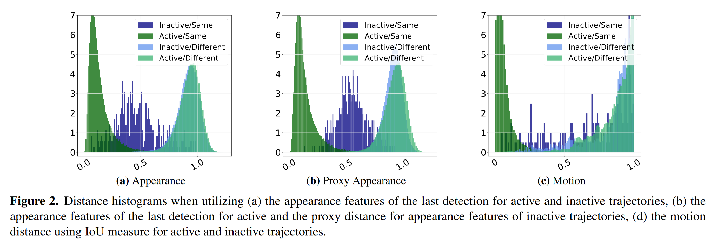

# Simple Cues Lead to a Strong Multi-Object Tracker
https://arxiv.org/pdf/2206.04656

## Abstract
- 提出了Good Old Hungarian Simple Tracker (GHOST)
  - 两个关键要素，使标准的reID网络能够在基于外观的跟踪方面表现出色
    - 动态域适应
    - 针对active和inactive的不同策略
  - 不需要在tracking数据集上训练
  - 在MOT17、MOT20、BDD100k、DanceTrack数据集上超过了SOTA

- 分析了它的失败案例，并表明本文的外观特征与简单运动模型的结合可以带来强大的跟踪结果
  - 在不同的可见度、遮挡时间和相机移动条件下分析，以确定在哪些情况下reID还不够，需要运动模型

## Introduction
- 一个观察：仅仅使用最先进的reID网络进行外观匹配对于MOT的真实场景来说是不够的。图1可视化了Market-1501数据集（x 轴）上几种最先进的reID方法的性能，表明reID性能不一定转化为MOT性能。分析了reID在MOT上表现不佳的问题：
  - 虽然在附近的帧中目标的外观变化很小，但在较长的时间间隔中预计会发生更严重的变化，比如发生部分遮挡、姿态变化
  - 由于图像数据各不相同，因此不同MOT序列之间的reID性能往往不一致，这反过来又不同于reID训练数据集的相对稳定条件
- inactive和active track
  - 一个track在某帧没有新的检测匹配，认为是inactive track，否则，认为是active track

## Methodology
## A simple tracking-by-detection tracker
使用简单常规的tracking的pipeline  

## Strong appearance model for MOT
- 本文的基础reID模型
  - 基于ResNet50，在常规的person reID数据集训练
  - 没有在任何MOT数据集上训练
  - 该基础模型在MOT任务上表现并不好
- Appearance distance histograms (外观距离直方图)

- 对active和inactive track的不同处理
  - 动机：在图2(a)中，Active/Same和Inactive/Same的直方图区别非常大，表明应当对active和inactive的track采取不同的处理。此外inactive的正匹配和负匹配之间的重叠，显示出了遮挡后匹配的固有困难
  - 处理：
    - 对active的track，利用track在 $t-1$ 帧的检测的外观特征计算 $t$ 帧的检测的距离
    - 对inactive的track，利用track的所有检测的外观特征计算 $t$ 帧的检测的距离，并计算这些距离的平均值作为proxy distance
  - proxy distance的可视化在图2(b)中，看起来分离性更好，对检测和inactive track之间的真实底层距离做了更稳健的估计
  - 从直方图中可以看出，对inactive和active的track可以分别采用不同的阈值做匹配
- 动态域适应 (On-the-fly Domain Adaptation)
  - reID领域的最新发展建议应用域适应 (DA) 技术，因为源数据集统计数据可能与目标数据集统计数据不匹配。本文建议应用动态DA，以防止reID模型在应用于不同的MOT序列时性能下降。具体做法：
    - 在架构的BN层中利用当前批次特征的均值和方差，这对应于测试期间一帧中的检测：
     

  
    - 不需要任何复杂的训练过程或测试时间适应，也不需要几个BN层，但这可以很好地近似序列的统计数据，因为一个序列的所有图像都具有高度相似的基础分布，并导致跟踪序列之间的距离直方图更加相似。这反过来又允许我们定义非常适合所有序列的匹配阈值，即很好地分离所有直方图