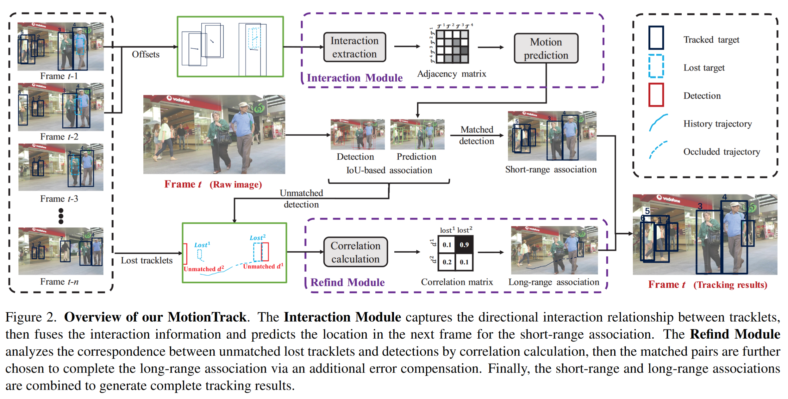

# MotionTrack: Learning Robust Short-term and Long-term Motions for Multi-Object Tracking
paper: https://arxiv.org/pdf/2303.10404
## Abstract
- 提出了一个简单高效的 MOT 框架：MotionTrack
  - 用一个统一的框架学习短期和长期的运动，从而关联短期和长期的track
  - 对于密集人群：设计了一个Interaction Module，从短期轨迹中学习交互感知运动，它可以估计每个目标的复杂运动
  - 对于极度遮挡：设计了一个Refind Module，从目标的历史轨迹中学习可靠的长期运动，该模块可以将中断的轨迹与其相应的检测联系起来
- Interaction Module和Refind Module被嵌入到了tracking-by-detection范式中，它们可以协同工作以保持卓越的性能
- MOT17、MOT20数据集上达到了SOTA
- 应对场景：密集人群、极度遮挡

## Introduction
现存的MOT方法的两种范式：
- tracking-by-detection：首先检测每个视频帧中的对象，然后关联相邻帧之间的检测以随着时间的推移创建单独的目标轨迹
- tracking-by-regression：目标检测器不仅提供逐帧检测，还用每个轨迹到其新位置的连续回归来替换数据关联

面临的问题：短期和长期
- 短期：如何在短时间内将活动的轨迹与检测关联起来
  - 过去的方法：相邻帧使用可区分性的运动模式或外观特征来引导数据关联
  - 存在的问题：
    - 密集人群：行人的运动不是独立的，会受到周围邻居的影响以避免碰撞，故难以学习运动模式
    - 极度遮挡：行人很容易被固定物体长期遮挡，被遮挡的行人的检测框的尺寸会小到难以取得准确的外观特征
- 长期：如何在长时间后重新识别丢失的轨迹与检测
  - 过去的方法：
    - 学习可区分性的外观特征对被遮挡而丢失的track做重识别
    - memory技术：为每个目标存储特征以multi-query的方式匹配不同目标
  - 存在的问题：
    - 不同姿势、低分辨率、低照明：影响外观特征
    - memory模块和Multi-query机制的存储和时间开销很大：不利于实时tracking

贡献：
- 提出了一个简单高效的 MOT 框架：MotionTrack。遵循tracking-by-detection范式
- 为解决短期关联：设计了一个Interaction Module，用于模拟目标之间的所有交互
  - 可以预测行人的复杂运动以避免碰撞
  - 使用非对称邻接矩阵来表示目标之间的交互
  - 通过图卷积网络进行信息融合后得到预测
- 为解决长期关联：设计了一个Refind Module，用于重新识别丢失的目标
  - 相关性计算：将历史轨迹和当前检测的特征作为输入，并计算相关矩阵来表示它们关联的可能性
  - 误差补偿：修正被遮挡的轨迹
- MOT17、MOT20数据集上达到了 SOTA

## Related Work
### Motion Models
运动模型可以分为：
- filter-based方法：将运动预测视为状态估计
  - KF：卡尔曼滤波。线性恒速模型，基于目标和相机运动是独立的假设，如SORT
  - camera motion compensation：相机运动补偿，如：BoT-SORT、StrongSORT
  - KF的变体：如：StrongSORT、GIAOTracker (mcmot)
- model-based方法：以基于数据驱动的范式，结合运动和视觉信息提供运动预测
  - Tracktor：采用Faster R-CNN的回归部分来预测相邻帧之间目标的位移
  - FFT：添加光流以帮助回归位移
  - CenterTrack：构建了一个tracking分支来专门预测运动
  - ArTIST：将运动视为一种概率分布，并通过最大池化对一个特征隐式建模所有周围的交互
  - 问题：大多数运动模型不考虑目标之间的显式交互，尤其是在密集的人群场景中。他们无法准确估计附近目标的复杂运动

### Occlusion
遮挡分为短期遮挡和长期遮挡：
- 短期遮挡
  - [TADAM](https://arxiv.org/pdf/2104.00380)：将未遮挡和遮挡目标分开
- 长期遮挡
  - DeepSORT：先将检测框匹配到存活的track上，然后基于外观特征匹配到丢失的track上
  - MeMOT：将track的外观特征存储到memory中，用检索
  - QuoVadis：将轨迹转换为鸟瞰图
  - ByteTrack：利用迭代预测的track (丢失的) 和检测之间的IoU分数做重识别
  - 问题：随着遮挡时间变长，这些方法将变得不太可靠

# Method

## Overview of MotionTrack
MotionTrack分为两步：
- Step1：短期关联。对track间交互进行建模以获得更准确的预测和短程跟踪结果
- Step2：长期关联。根据历史track和不匹配的检测重新识别丢失的track，然后在遮挡期间补偿track

## Interaction Module
构建track之间的定向交互以获得帧$t$的预测。分为两个阶段：
- Interaction Extraction (交互提取)。如图3所示，连接绝对坐标矩阵和坐标偏移量矩阵，输入这个连接矩阵，经过一些操作，输出一个非对称交互矩阵，每个元素表示一个track对另一个track的影响。具体的操作有：
  - 连接矩阵先输入到自注意力模块
  - 为进一步考虑整个场景，如群体行为，将自注意力的结果，级联输入到非对称卷积模块
  - 为了捕获track之间的重要交互，只保留高注意力值
  - 归一化交互矩阵的所有非零元素
- Motion Prediction (运动预测)。如图4所示，提取交互矩阵后具体的操作有：
  - 使用图卷积来融合每个track的交互
  - 使用MLP获得偏移量预测
- 与ByteTrack一样的关联策略：用匹配上的检测去更新存活的track，记录丢失的track的Interaction Module的预测

## Refind Module
Refind Module：
- 首先根据track的空间分布和速度-时间关系计算丢失的track与不匹配的检测之间的相关性，以获得相关矩阵
- 然后保留高度相关的pairs，利用误差补偿来细化track
- 最后结合短期和长期的关联来生成帧$t$的完整track结果

